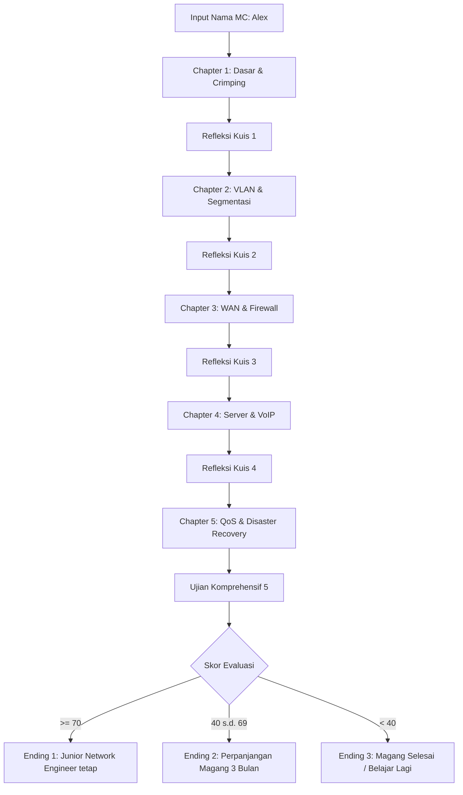
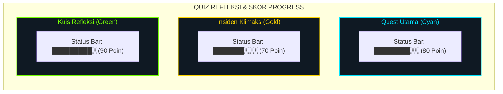
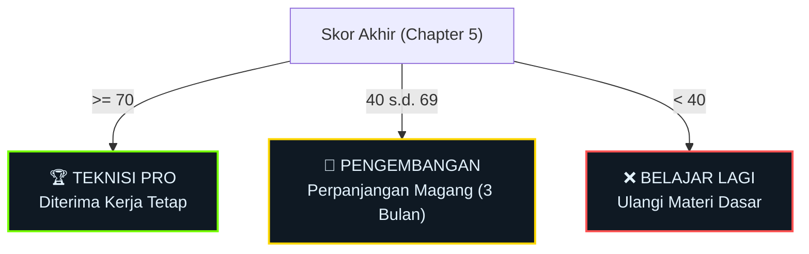

# 📘 Guide Book: NetPro - Magang Jaringan 🌐
*Buku Panduan Komprehensif Desain & Gameplay Visual Novel Edukasi TKJ*

---

## 🎨 Panduan Identitas Visual & Tema "Dark Tech"
Sebelum menyusun Guide Book di Canva, pastikan menggunakan palet warna dan logo resmi dari game **NetPro: Magang Jaringan** agar konsisten dengan atmosfer *cyberpunk/networking terminal* yang ada di dalam game.

### 📍 Aset Logo Resmi
- **Logo Utama:** `game/logo/NetPro-Logo.png`
- **Visual Pendukung:** Gunakan elemen kabel RJ-45, terminal command line, dan topologi jaringan Cisco Packet Tracer.

### 🎨 Palet Warna Tema (Dark Tech)
Gunakan kode hex di bawah ini sebagai dasar pembuatan palet warna (Color Palette) pada template Canva atau GPT/Codex:

| Elemen Desain | Kode Hex | Visual Representasi / Karakter |
| :--- | :---: | :--- |
| **Latar Belakang Utama** | `#0D1117` | Latar gelap premium (GitHub style) |
| **Latar Belakang Panel** | `#0F1923` | Latar menu, frame popup, & terminal |
| **Aksen Utama (Cyan)** | `#00E5FF` | Cyber accent, teks aktif, & nama Alex (`mc`) |
| **Aksen Penting (Gold)** | `#FFD700` | Sorotan materi penting, nama Pak Hendra (`mentor`) |
| **Teks Utama** | `#E3F2FD` | Warna putih kebiruan untuk keterbacaan tinggi |
| **Teks Sekunder (Muted)** | `#78909C` | Abu-abu kebiruan untuk deskripsi & shortcut tombol |
| **Indikator Sukses (Hijau)**| `#76FF03` | Validasi benar, nama Rafi, & status ONLINE |
| **Indikator Peringatan** | `#FFD740` | Status WARNING & notifikasi kuis |
| **Indikator Bahaya (Merah)**| `#FF5252` | Koneksi DOWN, status RTO, & error input |

---

## 1. Cover
Bagian cover buku panduan di Canva harus memberikan impresi pertama yang profesional, modern, dan bernuansa IT.

**Struktur Halaman Cover:**
- **Visual Utama:** Logo **NetPro: Magang Jaringan** di bagian tengah atas, dikelilingi ornamen garis-garis sirkuit atau kabel jaringan digital.
- **Judul Buku:** BUKU PANDUAN GAME (Font: *Montserrat / Orbitron*, Size: Large, Color: `#E3F2FD`)
- **Sub-Judul:** Simulasi Magang & Troubleshooting Jaringan Komputer TKJ (Color: `#00E5FF`)
- **Informasi Pembuat:**
  ```text
  Disusun oleh:
  Eko Muhammad Rizki
  [Proyek Matakuliah Multimedia - Teknik Komputer & Jaringan]
  ```
- **Footer:** Target Platform: Windows • Android • macOS • Linux

---

## 2. Tentang Game
Halaman ini menjelaskan esensi dari game agar pembaca memahami latar belakang dan urgensi modul pembelajaran interaktif ini.

**Isi Halaman Tentang Game:**
- **Nama Game:** NetPro: Magang Jaringan
- **Tema:** *Visual Novel Edukasi & Simulator Teknik Komputer Jaringan (TKJ)*
- **Tujuan Game:** Menjembatani celah teori di kelas dengan praktek lapangan secara interaktif dan aman (tanpa risiko merusak perangkat asli).
- **Target Pemain:** Siswa SMK Jurusan TKJ, Mahasiswa IT, serta peminat jaringan komputer.
- **Materi Utama yang Dipelajari:**
  1. **Crimping Kabel UTP:** Standarisasi pinout T568A dan T568B.
  2. **OSI Layer Model:** Bottom-up troubleshooting dari Physical hingga Application Layer.
  3. **VLAN & Subnetting:** Segmentasi logis, port security, & Inter-VLAN Routing (Router-on-a-Stick).
  4. **WAN & Network Security:** Dynamic Routing OSPF, Internet Gateway NAT (PAT), & Extended ACL Firewall.
  5. **Server & QoS:** DNS Server (BIND9), VoIP (Asterisk PBX), Web Proxy (Squid), dan Bandwidth Management.

> [!NOTE]
> **Sinopsis Cerita:** Pemain berperan sebagai **Alex (mc)**, seorang anak magang baru di **PT. Nusanet Teknologi**. Dipandu oleh senior teknisi yang tegas namun suportif, **Pak Hendra**, Alex harus memecahkan kasus-kasus jaringan harian, menghadapi ancaman ransomware, hingga merancang sistem enterprise untuk mendapatkan tawaran kerja tetap.

---

## 3. Tampilan Awal Game
Menjelaskan pengalaman pengguna (UX) pertama saat membuka game NetPro.

- **Splash Screen / Intro Video:**
  Memutar cuplikan video intro bioskop (`movies/intro_awal.webm` atau `.mp4`) yang memperlihatkan monitor server berkedip dan suara kipas server yang realistis.
- **Layar Splash TKJ (`splash_tkj`):**
  Layar interaktif minimalis dengan logo berkilau, teks `NETPRO: Magang Jaringan - Visual Novel Edukasi TKJ`, dan tombol besar `▶ MULAI PETUALANGAN`.
- **Menu Input Nama:**
  Layar terminal input tempat pemain mengetik nama panggilannya (Default: `Alex`). Nama ini akan digunakan di sepanjang percakapan game dengan warna aksen Cyan (`#00E5FF`).

---

## 4. Petunjuk Tombol (Button Interface)
Berikut adalah daftar ikon dan tombol kontrol UI yang digunakan dalam game NetPro.

| Tombol / Ikon | Letak / Posisi | Fungsi Utama | Aksi Hover (Efek) |
| :--- | :--- | :--- | :--- |
| **Mulai Petualangan**| Splash Screen | Memulai game & memicu input nama pemain | Latar berubah ke Biru Cerah `#0277BD` |
| **Pilihan Menu** | Dialog Screen | Menentukan percabangan cerita & jawaban kuis | Berubah menjadi Cyan `#00E5FF` |
| **SYS RESET** | Simulator Panel | Menghapus susunan kabel crimping (kembali ke awal)| Tombol menyala Merah Terang |
| **REMOVE** | Simulator Panel | Menghapus satu kabel terakhir yang dipasang | Tombol menyala Kuning/Orange |
| **EXECUTE TESTER** | Simulator Panel | Menguji hasil susunan kabel pada Tester RJ-45 | Tombol menyala Biru Kustom |
| **ACKNOWLEDGE** | Tester Result | Menutup log hasil crimping untuk melanjutkan cerita| Latar hijau (sukses) atau merah (gagal) |
| **HUD SKOR** | Pojok Kanan Atas | Menampilkan poin sementara secara real-time | Transparan, tidak menghalangi cerita |

---

## 5. Menu Utama (Main Menu)
Penjelasan struktur navigasi Menu Utama game berbasis Ren'Py yang disesuaikan dengan tema Dark Tech.

- **Pilihan Menu Utama:**
  - **Mulai Baru / Load Game:** Melanjutkan petualangan magang Alex.
  - **Pengaturan (Settings):** Mengatur volume musik (`bgm_ch1.mp3`, `bgm_trouble.mp3`), suara transisi teks, serta mode fullscreen.
  - **Profil Pengembang:** Informasi akademik, email, dan kontribusi pembuat game.
  - **Keluar (Quit):** Menghentikan permainan dan kembali ke OS.
- **UI Design System:**
  Latar belakang menu menggunakan `#0D1117` dengan overlay hitam transparan 80% (`#000000CC`) agar tombol menu navigasi berwarna `#90CAF9` menonjol dengan jelas saat disorot kursor.

---

## 6. Fitur Cerita / Story Mode
Menjelaskan struktur narasi permainan yang terbagi menjadi **5 Bab Utama (5 Chapters)** yang merepresentasikan 5 minggu masa magang Alex di PT. Nusanet Teknologi.



### Karakter Utama:
1. **Alex (mc):** Pemain utama, anak magang yang tekun dan bersemangat.
2. **Pak Hendra (mentor):** Teknisi Senior yang membimbing, sering memberi petunjuk teknis penting.
3. **Rafi (rafi):** Sesama rekan magang yang santai, sering memberikan saran keliru atau jenaka tapi setia kawan.
4. **Bu Dewi (client):** Staf Keuangan/User yang awam teknologi, sering panik jika internet terganggu.
5. **Pak Admin (admin):** IT Administrator Perusahaan yang bertugas mengevaluasi rapor akhir Alex.

---

## 7. Fitur Level / Misi / Tantangan (Chapters)
Bagian ini merinci setiap tantangan teknis yang dihadapi di tiap Chapter game:

### 🔌 Chapter 1: Dasar Jaringan & Crimping
- **Misi Utama:** Menghubungkan workstation baru ke switch utama dan merakit kabel UTP secara fisik.
- **Konsep Pembelajaran:**
  - **Tantangan 1 (Jenis Kabel):** Memilih jenis kabel yang tepat antara PC ke Switch (**Straight-through**) vs perangkat sejenis (**Crossover**).
  - **Tantangan 2 (Crimping Simulator):** Menyusun 8 pin kawat warna-warni secara berurutan sesuai standar T568B atau T568A.
- **Bottom-Up Troubleshooting:** Diagnosa internet Bu Dewi yang mati total karena kabel LAN terlepas di Switch port Layer 1 (Physical).
- **Insiden Klimaks:** Jaringan kantor mengalami kelumpuhan total akibat **Broadcast Storm** (Loop topologi). Solusinya adalah mengisolasi port loop dan mengaktifkan **Spanning Tree Protocol (STP)**.

  #### 📊 Diagram Loop Switch (Penyebab Broadcast Storm)
  Berikut adalah visualisasi topologi switch yang terhubung secara melingkar (redundant) tanpa adanya STP aktif, yang menyebabkan paket broadcast berputar tanpa henti:

  ```mermaid
  flowchart TD
      SW_Top["SW"]
      SW_TL["SW"]
      SW_TR["SW"]
      SW_BL["SW"]
      SW_BR["SW"]

      SW_TL --- SW_Top
      SW_Top --- SW_TR
      SW_TR --- SW_BR
      SW_BR --- SW_BL
      SW_BL --- SW_TL
      SW_BL ---|"⚠️ LOOP!"| SW_TR

      classDef swStyle fill:#0F1923,stroke:#00E5FF,stroke-width:2px,color:#E3F2FD,font-weight:bold;
      class SW_Top,SW_TL,SW_TR,SW_BL,SW_BR swStyle;

      linkStyle 0 stroke:#FF5252,stroke-width:3px;
      linkStyle 1 stroke:#FF5252,stroke-width:3px;
      linkStyle 2 stroke:#FF5252,stroke-width:3px;
      linkStyle 3 stroke:#FF5252,stroke-width:3px;
      linkStyle 4 stroke:#FF5252,stroke-width:3px;
      linkStyle 5 stroke:#FFD700,stroke-width:5px;
  ```

  > [!WARNING]
  > **Analisis Loop Jaringan:**
  > 1. **Redundant Path:** Sambungan kabel tambahan (kabel kuning antara **SW Bottom-Left** dan **SW Top-Right**) ditujukan sebagai jalur cadangan.
  > 2. **Tanpa STP:** Karena protokol Spanning Tree tidak diaktifkan, switch tidak memblokir jalur cadangan ini secara logis.
  > 3. **Broadcast Storm:** Paket broadcast (seperti ARP Request) terus berputar di semua arah tanpa henti, memakan seluruh bandwidth dan melumpuhkan total jaringan (*CPU 100% / lampu switch berkedip tidak normal*).
  >
  > **🛠️ Solusi & Langkah Diagnosa:**
  > - **Langkah Cepat (Isolasi Port):** Cabut atau shutdown port fisik yang terhubung ke jalur loop (kabel kuning).
  > - **Solusi Permanen (STP):** Aktifkan **Spanning Tree Protocol (STP)** di semua switch agar switch mendeteksi loop secara otomatis dan memblokir port cadangan secara logis tanpa mengorbankan redundansi fisik.


### ⚡ Chapter 2: VLAN & Segmentasi Jaringan
- **Misi Utama:** Membagi jaringan datar (Flat Network) yang tidak aman menjadi subnet terpisah untuk divisi IT, Marketing, dan Finance.
- **Konsep Pembelajaran:**
  - **Subnetting IPv4:** Menghitung alokasi network `/26` (blok 64 IP) untuk pembagian divisi.
    
    #### 📊 Diagram Mockup Pembagian VLAN & Subnet /26
    Berikut adalah skema segmentasi jaringan flat menjadi 3 divisi mandiri dengan keamanan optimal:

    ```mermaid
    flowchart TD
        subgraph VLAN_Subnetting ["VLAN & Subnetting /26"]
            subgraph IT ["VLAN 10 IT"]
                IT_Net["IP Network: 192.168.10.0/26"]
                IT_Hosts["62 Valid Hosts (.1 - .62)"]
            end

            subgraph Marketing ["VLAN 20 MARKETING"]
                Mkt_Net["IP Network: 192.168.10.64/26"]
                Mkt_Hosts["62 Valid Hosts (.65 - .126)"]
            end

            subgraph Finance ["VLAN 30 FINANCE"]
                Fin_Net["IP Network: 192.168.10.128/26"]
                Fin_Hosts["62 Valid Hosts (.129 - .190)"]
            end
        end

        %% Styling
        classDef itStyle fill:#0F1923,stroke:#00E5FF,stroke-width:2px,color:#E3F2FD;
        classDef mktStyle fill:#0F1923,stroke:#FFD700,stroke-width:2px,color:#E3F2FD;
        classDef finStyle fill:#0F1923,stroke:#76FF03,stroke-width:2px,color:#E3F2FD;

        class IT_Net,IT_Hosts IT;
        class Mkt_Net,Mkt_Hosts Marketing;
        class Fin_Net,Fin_Hosts Finance;
        
        class IT itStyle;
        class Marketing mktStyle;
        class Finance finStyle;
    ```

    | Divisi | VLAN ID | Alokasi Network | Range IP Host Valid | IP Broadcast |
    | :--- | :---: | :--- | :--- | :--- |
    | **IT Dept** | `10` | `192.168.10.0/26` | `192.168.10.1` s.d. `192.168.10.62` | `192.168.10.63` |
    | **Marketing** | `20` | `192.168.10.64/26` | `192.168.10.65` s.d. `192.168.10.126` | `192.168.10.127` |
    | **Finance** | `30` | `192.168.10.128/26`| `192.168.10.129` s.d. `192.168.10.190`| `192.168.10.191` |

  - **Konfigurasi Switch:** Memasukkan interface fisik ke VLAN menggunakan command `switchport mode access` dan `switchport access vlan <ID>`.
  - **Inter-VLAN Routing:** Mempertemukan kembali traffic aman antar VLAN menggunakan teknik **Router-on-a-Stick (ROAS)**.
- **Insiden Klimaks (Rogue Device):** Tamu mencolokkan laptop asing ke port lobi. Solusinya adalah menerapkan **Switchport Port-Security** dengan aksi **Violation Shutdown** untuk mengunci port secara otomatis (*err-disable*).

### 🌐 Chapter 3: WAN, NAT, & Security Firewall
- **Misi Utama:** Menghubungkan Kantor Pusat (HQ) dengan Kantor Cabang baru di luar kota serta mengamankan gateway internet.
- **Konsep Pembelajaran:**
  - **Dynamic Routing OSPF:** Mempelajari rute cabang secara otomatis menggunakan algoritma link-state cost terkecil.
  - **NAT Overload (PAT):** Mentranslasikan IP Private lokal ke satu IP Public agar seluruh staf bisa berselancar di internet.

    #### 📊 Diagram Sederhana HQ, Cabang, ISP, dan Internet (WAN OSPF + NAT/PAT)
    Berikut adalah skema diagram interkoneksi WAN OSPF dan translasi internet gateway NAT/PAT:

    ```mermaid
    flowchart TD
        subgraph WAN_Topology ["WAN OSPF + NAT/PAT Topology"]
            ISP["☁️ ISP (Internet Service Provider)"]
            HQ["🌀 HQ Router (Kantor Pusat)"]
            Branch["🌀 Cabang (Kantor Cabang)"]
            Internet["🌐 Internet Publik"]
        end

        %% Connections
        HQ ===|OSPF| ISP
        ISP ===|OSPF| Branch
        HQ ===|PAT (NAT Overload)| Internet
        Branch ===|WAN Link| Internet

        %% Styling
        classDef mainStyle fill:#0F1923,stroke:#00E5FF,stroke-width:2px,color:#E3F2FD;
        classDef ispStyle fill:#0F1923,stroke:#FFD700,stroke-width:2px,color:#E3F2FD;
        
        class HQ,Branch,Internet mainStyle;
        class ISP ispStyle;
    ```

    * **Routing OSPF:** Digunakan untuk merutekan lalu lintas data internal secara dinamis antar router **HQ** dan kantor **Cabang** melewati **ISP** dengan jalur terpendek (metrik cost terkecil).
    * **NAT Overload (PAT):** Mentranslasikan ribuan alamat IP Private lokal dari **HQ Router** menggunakan hanya satu IP Public resmi sebelum dilemparkan ke **Internet Publik** untuk alasan efisiensi IP dan keamanan.

- **Insiden Klimaks (Brute Force Attack):** Server Database diserang brute force hacker melalui port Telnet (23). Solusinya adalah menerapkan **Extended Access Control List (ACL)** untuk menolak (*deny*) traffic port 23 dari internet menuju server.

    #### 📊 Diagram Sederhana Extended ACL Firewall
    Berikut adalah skema penanganan brute force di perimeter keamanan jaringan menggunakan Extended ACL:

    ```mermaid
    flowchart LR
        subgraph Security_Perimeter ["Perimeter Keamanan (Extended ACL)"]
            Attacker["💀 Attacker\n(Hacker Telnet Port 23)"]
            Firewall["🛡️ FIREWALL\ndeny tcp any host server eq 23"]
            DB["🗄️ DB SERVER\n(Data Sensitif)"]
        end

        %% Flow
        Attacker ==>|Koneksi Telnet - BLOCKED| Firewall
        Firewall ==>|Traffic Aman - PERMITTED| DB

        %% Styling
        classDef redStyle fill:#0F1923,stroke:#FF5252,stroke-width:2px,color:#E3F2FD;
        classDef goldStyle fill:#0F1923,stroke:#FFD700,stroke-width:2px,color:#E3F2FD;
        classDef greenStyle fill:#0F1923,stroke:#76FF03,stroke-width:2px,color:#E3F2FD;

        class Attacker redStyle;
        class Firewall goldStyle;
        class DB greenStyle;
    ```

    * **Extended ACL (Access Control List):** Bekerja pada Layer 3 dan Layer 4 OSI Model. Dibandingkan Standard ACL yang hanya memeriksa IP asal, Extended ACL mampu memfilter paket berdasarkan IP asal, IP tujuan, protokol (TCP/UDP), dan nomor port aplikasi (`eq 23`).
    * **Mekanisme Kerja:**
      1. Paket *Brute Force* Telnet dari **Attacker** masuk ke router gateway.
      2. Router mencocokkan paket dengan aturan pertama: `deny tcp any host <IP_Server> eq 23`. Karena cocok, paket langsung **DIBUANG (Dropped)**.
      3. Lalu lintas operasional aman lainnya lolos karena aturan berikutnya: `permit ip any any`. Jaringan tetap aman tanpa mengganggu kinerja divisi lain.

### 🖥️ Chapter 4: Server Administrator & VoIP
- **Misi Utama:** Mengembangkan layanan aplikasi jaringan tingkat lanjut (Layer 7) untuk efisiensi operasional.
- **Konsep Pembelajaran:**
  - **DNS Server (BIND9):** Mengubah akses IP absen yang rumit (`192.168.10.50`) menjadi domain bersahabat `absen.nusanet.local`.
  - **VoIP SIP Server (Asterisk):** Menyediakan telepon lokal gratis antar divisi menggunakan protokol SIP dengan register nomor ekstensi.

    #### 📊 Diagram Mockup Tiga Layan Server (DNS, VoIP & PROXY SERVER)
    Berikut adalah skema visualisasi tiga layanan server utama yang berjalan pada Layer 7 (Application Layer) OSI Model:

    ```mermaid
    flowchart TD
        subgraph Server_Services ["DNS, VoIP & PROXY SERVER (Layer 7)"]
            subgraph DNS ["🖥️ DNS BIND9"]
                DNS_Desc["Translasi IP ↔ Domain"]
                DNS_Example["absen.nusanet.local"]
            end

            subgraph VoIP ["🖥️ VoIP Asterisk"]
                VoIP_Desc["IP Telephony (PBX)"]
                VoIP_Example["SIP extensions (1001, 1002)"]
            end

            subgraph Proxy ["🖥️ Squid Proxy"]
                Proxy_Desc["Web Filtering (Layer 7)"]
                Proxy_Example["deny dst-domain / URL drop"]
            end
        end

        %% Styling
        classDef cyanStyle fill:#0F1923,stroke:#00E5FF,stroke-width:2px,color:#E3F2FD;
        classDef greenStyle fill:#0F1923,stroke:#76FF03,stroke-width:2px,color:#E3F2FD;
        classDef redStyle fill:#0F1923,stroke:#FF5252,stroke-width:2px,color:#E3F2FD;

        class DNS cyanStyle;
        class VoIP greenStyle;
        class Proxy redStyle;
    ```

    | Jenis Layanan Server | Paket Software | Fungsi Utama | Contoh Penerapan Konkrit |
    | :--- | :--- | :--- | :--- |
    | **DNS Server** | `BIND9` | Menterjemahkan nama domain (huruf) menjadi IP Address yang dimengerti mesin. | Mengubah akses IP absen `192.168.10.50` menjadi domain bersahabat `absen.nusanet.local` |
    | **VoIP Server** | `Asterisk` | Menyediakan jalur komunikasi suara interaktif di atas infrastruktur LAN. | Mendaftarkan nomor ekstensi SIP (seperti `1001`, `1002`) untuk telepon internal gratis antar divisi |
    | **Web Proxy** | `Squid` | Menyaring dan mengendalikan akses web client berdasarkan URL/Domain tujuan. | Mencegah pembengkakan bandwidth dengan aturan `deny dst-domain` untuk melarang akses ke situs film ilegal |

- **Insiden Klimaks (Bandwidth Hogg):** Rafi mengunduh file video 4K ilegal yang menghabiskan kuota internet kantor. Solusinya adalah menerapkan **Web Proxy Server (Squid)** dengan aturan pemblokiran domain (*deny dst-domain*) untuk melarang situs film tersebut.

### 👑 Chapter 5: Advanced Management & Disaster Recovery
- **Misi Utama:** Menyempurnakan manajemen infrastruktur dan menyiapkan skenario bencana terburuk.
- **Konsep Pembelajaran:**
  - **Bandwidth Management:** Mengkonfigurasi **Simple Queue / QoS** di router untuk memprioritaskan Zoom Meeting petinggi dan membatasi (*bandwidth shaping*) divisi lain.
  - **Remote Access VPN:** Membuat terowongan VPN terenkripsi (**L2TP/IPSec**) agar CEO dari luar negeri dapat mengakses data rahasia kantor dengan aman melalui internet publik.

    #### 📊 Diagram Ringkasan QoS, VPN & Disaster Recovery
    Berikut adalah skema ringkasan empat pilar penting manajemen canggih dan pemulihan bencana jaringan di Chapter 5:

    ```mermaid
    flowchart TD
        subgraph QoS_VPN_DR ["QoS, VPN & DISASTER RECOVERY (Chapter 5)"]
            subgraph QoS ["💙 QoS Simple Queue"]
                QoS_Desc["Prioritas Zoom CEO"]
                QoS_Details["Limit bandwidth Finance, prioritaskan traffic video konferensi"]
            end

            subgraph VPN ["💛 VPN L2TP/IPSec"]
                VPN_Desc["Akses Aman Remote"]
                VPN_Details["Tunnelling enkripsi data rahasia melintasi internet publik"]
            end

            subgraph Containment ["❤️ Ransomware Containment"]
                Cont_Desc["Isolasi Fisik Layer 1"]
                Cont_Details["Cabut LAN PC terinfeksi secepatnya untuk stop malware menyebar"]
            end

            subgraph Restore ["💚 Backup Restore"]
                Rest_Desc["Pemulihan Konfigurasi"]
                Rest_Details["Import file .rsc bulanan untuk memulihkan seluruh rule router"]
            end
        end

        %% Styling
        classDef cyanStyle fill:#0F1923,stroke:#00E5FF,stroke-width:2px,color:#E3F2FD;
        classDef goldStyle fill:#0F1923,stroke:#FFD700,stroke-width:2px,color:#E3F2FD;
        classDef redStyle fill:#0F1923,stroke:#FF5252,stroke-width:2px,color:#E3F2FD;
        classDef greenStyle fill:#0F1923,stroke:#76FF03,stroke-width:2px,color:#E3F2FD;

        class QoS cyanStyle;
        class VPN goldStyle;
        class Containment redStyle;
        class Restore greenStyle;
    ```

    | Konsep Pembelajaran | Kategori Aksi | Penjelasan Teknis Sederhana | Tujuan Utama |
    | :--- | :--- | :--- | :--- |
    | **QoS Simple Queue** | Optimasi Bandwidth | Membatasi (*limiting/shaping*) kecepatan unduh divisi tertentu serta memberi prioritas utama (*priority 1*) pada paket video rapat. | Menjamin kelancaran Zoom Meeting jajaran direksi tanpa terganggu oleh aktivitas download divisi lain. |
    | **VPN L2TP/IPSec** | Keamanan Data | Membuat terowongan virtual terenkripsi (*encrypted tunnel*) di atas internet publik menggunakan protokol L2TP yang dibalut dengan IPSec. | Memberikan hak akses remote yang aman bagi CEO di luar negeri untuk terhubung langsung ke Server internal kantor. |
    | **Ransomware Containment** | Aksi Cepat Layer 1 | Tindakan isolasi fisik seketika dengan mencabut kabel LAN dari komputer pasien yang terinfeksi ransomware dari dinding. | Menghentikan penyebaran lateral malware (*lateral movement*) agar tidak menjalar dan mengunci file di Server Utama. |
    | **Backup Restore** | Disaster Recovery | Mengembalikan (*import*) berkas salinan konfigurasi router berbasis teks skrip `.rsc` yang telah dicadangkan secara berkala. | Memulihkan seluruh konfigurasi VLAN, Routing, NAT, dan firewall router dalam hitungan detik setelah terkena kegagalan. |

- **Insiden Klimaks (Disaster Recovery):** PC Keuangan terkena infeksi virus **Ransomware** yang mulai mengunci data, sedangkan Router utama terhapus ke *Factory Default* akibat kabel tersenggol.
- **Aksi Cepat 30 Detik:**
  1. *Langkah 1 (Layer 1):* Cabut kabel LAN PC terinfeksi dari dinding untuk melokalisir ransomware (*containment*).
  2. *Langkah 2 (Recovery):* Restore file konfigurasi router `.rsc` dari salinan bulanan yang disimpan.

---

## 8. Fitur Quiz (Refleksi Materi)
Setiap bab diakhiri dengan **Kuis Refleksi** interaktif berisi 5 soal pilihan ganda. Setiap jawaban benar menyumbang **+10 Poin Bonus**.

### Contoh Soal Refleksi Utama untuk Canva/Codex Generator:
1. **Soal Jenis Kabel (Ch 1):** Hubungan PC workstation ke Switch port menggunakan kabel apa?
   - *Jawaban Benar:* **Straight-through** (T568B ke T568B).
2. **Soal Host Valid (Ch 2):** Berapakah jumlah IP host valid pada subnet mask `/26`?
   - *Jawaban Benar:* **62 Host** (64 IP - 1 Network - 1 Broadcast).
3. **Soal Routing WAN (Ch 3):** Protokol routing dinamis berbasis link-state cost terkecil adalah?
   - *Jawaban Benar:* **OSPF** (Open Shortest Path First).
4. **Soal VoIP Port (Ch 4):** Protokol standar industri yang menegosiasikan sesi telepon digital adalah?
   - *Jawaban Benar:* **SIP** (Session Initiation Protocol).
5. **Soal Layer Proxy (Ch 5):** Di layer manakah Web Proxy Server (Squid) bekerja menyaring URL?
   - *Jawaban Benar:* **Layer 7** (Application Layer).

---

## 9. Fitur Game / Mini Game (RJ-45 Crimping Simulator)
Menjelaskan simulasi pemasangan konektor RJ-45 secara detail. Pemain harus menyusun kabel UTP pin 1 sampai 8 dari kiri ke kanan.

### Standar T568B (Paling Banyak Digunakan)
Digunakan untuk interkoneksi perangkat berbeda (PC ke Switch):
- **Pin 1:** Putih Orange (`#E65100`)
- **Pin 2:** Orange (`#BF360C`)
- **Pin 3:** Putih Hijau (`#2E7D32`)
- **Pin 4:** Biru (`#0D47A1`)
- **Pin 5:** Putih Biru (`#1976D2`)
- **Pin 6:** Hijau (`#1B5E20`)
- **Pin 7:** Putih Coklat (`#5D4037`)
- **Pin 8:** Coklat (`#3E2723`)

### Standar T568A (Standar Sekunder / Crossover Link)
Digunakan sebagai salah satu ujung kabel Crossover (PC ke PC):
- Pasangan warna Orange (Pin 1 & 2) ditukar posisi dengan pasangan warna Hijau (Pin 3 & 6).
- **Urutan Pin:** Putih Hijau - Hijau - Putih Orange - Biru - Putih Biru - Orange - Putih Coklat - Coklat.

---

## 10. Item, Bantuan, atau Power-Up (Sistem Pendukung)
Game NetPro menyajikan sistem asistensi belajar non-klasik untuk membantu pemain memecahkan simulasi:

- **Asistensi Senior (Pak Hendra Hint):**
  Jika pemain salah menjawab kuis atau tantangan sebanyak 3 kali berturut-turut, Pak Hendra akan muncul membocorkan petunjuk visual penting (seperti rumusan urutan warna kabel, singkatan APIPA, atau target port server).
- **Database Panduan Warna:**
  Tersedia *Floating Reference Bar* berisi diagram standar pin T568A/T568B yang menempel secara visual di atas layar simulator crimping sebagai panduan instan bagi pemain pemula.

---

## 11. Sistem Skor, Koin, dan Progress
Game mencatat kinerja pemain secara kuantitatif melalui skor akhir akumulatif untuk mengukur pemahaman materi dan hasil belajar.

#### 📊 Diagram Mockup Kuis Refleksi & Indikator Skor
Berikut adalah visualisasi rekap skor akhir dalam bentuk grafik bar status:



- **Mekanisme Perolehan Skor (Aturan Skor):**
  - **Quest Utama Benar:** Menambah **+20 s.d. +25 Poin** per keberhasilan tugas.
  - **Keputusan Insiden Klimaks:** Menambah **+30 s.d. +40 Poin** atas keputusan taktis darurat yang benar.
  - **Kuis Refleksi Akhir:** Menambah **+10 Poin per soal** (Maksimal **+50 Poin** per Chapter).
- **Penyimpanan Progress:**
  Menggunakan sistem `persistent.chapter_unlocked` dari Ren'Py yang menyimpan bab tertinggi yang telah berhasil dimainkan, memungkinkan pemain melompat kembali ke Chapter tertentu dari menu utama.

---

## 12. Kondisi Menang dan Kalah (Ending Evaluasi)
Akhir permainan (Act 5 / Chapter 5 Evaluasi) dievaluasi oleh Pak Admin dan Pak Hendra berdasarkan total perolehan skor pemain:

| Tipe Akhir Game | Rentang Skor | Kelayakan Kelulusan | Status Rapor Akhir |
| :--- | :---: | :--- | :--- |
| 🏆 **ENDING 1: TEKNISI PRO** | **Skor >= 70** | Sangat Memuaskan (Grade A/B) | **Diterima Kerja Tetap** sebagai *Junior Network Engineer* di PT. Nusanet Teknologi. |
| 🔄 **ENDING 2: PENGEMBANGAN** | **Skor 40 s.d. 69** | Cukup Memadai (Grade C) | **Perpanjangan Magang (3 Bulan)** untuk mempertajam konfigurasi Cisco Packet & Mikrotik. |
| ❌ **ENDING 3: BELAJAR LAGI** | **Skor < 40** | Kurang Memenuhi Syarat (Grade D)| **Magang Selesai Tanpa Rekrutmen**, disarankan mengambil sertifikasi CCNA dan mengulang materi dasar. |



### 📊 Representasi Visual Kartu Ending Evaluasi
Di akhir Chapter 5, performa pemain secara kumulatif disajikan dalam bentuk dashboard modular futuristik **3 Ending Evaluasi** bertema *Dark Tech*:
1. **Teknisi Pro Card (Hijau Neon `#76FF03`):** Menyala terang ketika skor `>= 70`, menandakan kelulusan mutlak dan rekrutmen *full-time*.
2. **Pengembangan Card (Emas `#FFD700`):** Menyala terang ketika skor `40 - 69`, menandakan masa perpanjangan magang untuk pemantapan lebih lanjut.
3. **Belajar Lagi Card (Merah `#FF5252`):** Menyala terang ketika skor `< 40`, memberikan arahan belajar mandiri dan bimbingan terstruktur.

*Catatan: Kartu yang tidak diperoleh oleh pemain akan tampil sedikit redup (dimmed opacity 0.4) untuk memberikan fokus visual yang tajam terhadap pencapaian pemain!*

---

## 13. Reset, Restart, dan Exit
Panduan navigasi penanganan progress pemain di dalam game:
- **Reset Game:** Melalui layar setting/menu utama untuk membersihkan variabel skor ke `0` dan mereset status progress chapter jika ingin meminjamkan game ke orang lain.
- **Restart Level:** Disediakan tombol **SYS RESET** di panel crimping jika pemain melakukan kesalahan fatal dalam penataan urutan kabel dan ingin memulai penyusunan kembali tanpa membuang waktu.
- **Exit to Menu:** Tombol interaktif untuk menyimpan permainan dan kembali ke halaman judul utama kapan saja.

---

## 14. Profil Pengembang
Informasi penyusun game untuk kebutuhan kreditasi media pembelajaran interaktif:

```text
Nama       : Eko Muhammad Rizki
Peran      : Lead Game Developer, UI Designer & Network Logic Programmer
Institusi  : Universitas Pendidikan Indonesia (UPI) / Sekolah Vokasi Teknik
Kontak     : https://github.com/EkoMuhammadRizki
Proyek     : Tugas Akhir / Proyek Matakuliah Multimedia & Jaringan Komputer
```

---

## 15. Informasi Sumber Asset
Daftar perangkat lunak dan aset media yang menopang berjalannya aplikasi NetPro:
- **Game Engine:** Ren'Py Visual Novel Engine v8.0+ (Python 3 berbasis skrip).
- **Desain UI & Aset Seni:** Canva Premium & Figma (Tema: Cyberpunk Dark Tech).
- **Aset Audio / BGM:**
  - `bgm_ch1.mp3` - Nada awal lab yang tenang.
  - `bgm_trouble.mp3` - Nada menegangkan/alarm untuk insiden server/hacker.
  - `bgm_quiz.mp3` - Nada kuis yang membutuhkan konsentrasi.
  - `bgm_success.mp3` - Nada kemenangan untuk keberhasilan perbaikan/Ending Pro.
- **Teks Font Utama:** DejaVu Sans & Orbitron (Gaya Digital Terminal).

---

## 16. Format Penyusunan Halaman Canva Guide Book
Bagi GPT atau Codex dengan integrasi Canva, silakan gunakan format layout berulang berikut untuk setiap halaman panduan agar rapi dan nyaman dibaca:

```text
[Header Halaman: Menggunakan Background Gelap #0D1117 dengan Aksen Cyan #00E5FF]
--------------------------------------------------------------------------------
1. Judul Modul / Chapter (Font: Orbitron Bold, Color: #E3F2FD)
2. Ilustrasi Visual / Screenshot Layout Jaringan (Garis tepi warna Neon #00E5FF)
3. Kotak Penjelasan Teori (Background Kotak: #0F1923, Teks: #E3F2FD)
4. Langkah Solusi Praktis / Sintaks Perintah Cisco & Mikrotik (Gaya Terminal code)
5. Keterangan Tombol Navigasi / Petunjuk Lanjutan (Teks Muted #78909C)
--------------------------------------------------------------------------------
[Footer: "NetPro Guide Book • Halaman [No] • Dibuat oleh Eko Muhammad Rizki"]
```

---

## 17. Rekomendasi Urutan Halaman Guide Book di Canva (Total: 16 Halaman)
1. **Halaman 1:** Cover Utama (Nuansa Jaringan, Logo NetPro, Identitas Penyusun).
2. **Halaman 2:** Daftar Isi & Panduan Palet Warna "Dark Tech".
3. **Halaman 3:** Bab 1 - Pengenalan Game, Sinopsis & Karakter (Alex, Pak Hendra, Rafi).
4. **Halaman 4:** Bab 2 - Tampilan Awal, Splash Screen & Petunjuk Tombol UI.
5. **Halaman 5:** Chapter 1 - Misi Kabel Straight vs Cross & Simulator Crimping RJ-45.
6. **Halaman 6:** Chapter 1 - Pemecahan Masalah Broadcast Storm & Spanning Tree Protocol.
7. **Halaman 7:** Chapter 2 - Subnetting IP `/26` & Konfigurasi VLAN Port Access/Trunk.
8. **Halaman 8:** Chapter 2 - Penerapan Inter-VLAN Routing (ROAS) & Keamanan Port-Security.
9. **Halaman 9:** Chapter 3 - WAN OSPF Dynamic Routing & Gateway NAT/PAT.
10. **Halaman 10:** Chapter 3 - Penanganan Insiden Keamanan dengan Extended ACL Firewall.
11. **Halaman 11:** Chapter 4 - Layanan DNS BIND9 & Konfigurasi VoIP SIP Asterisk Server.
12. **Halaman 12:** Chapter 4 - Manajemen Bandwidth dengan Web Proxy Squid URL Filtering.
13. **Halaman 13:** Chapter 5 - Bandwidth Limiting (QoS Simple Queue) & VPN L2TP/IPSec.
14. **Halaman 14:** Chapter 5 - Disaster Recovery, Containment Ransomware & Backup Restore.
15. **Halaman 15:** Rangkuman Kunci Soal Refleksi & Evaluasi Tiga Ending Kinerja.
16. **Halaman 16:** Kreditasi Aset, Sumber Daya Software, & Halaman Penutup.

---

## 18. Checklist Penyempurnaan Guide Book
Sebelum melakukan ekspor desain akhir PDF dari Canva, pastikan Anda mencentang checklist berikut:
- [x] Cover buku sudah memuat logo **NetPro: Magang Jaringan** yang presisi.
- [x] Kombinasi warna di Canva telah mengikuti palet warna **Dark Tech** (Latar `#0D1117`, Cyan `#00E5FF`, Gold `#FFD700`).
- [x] Semua 5 chapter pembelajaran telah ditulis alurnya secara berurutan.
- [x] Perintah Cisco IOS (`switchport`, `access-list`) dan Mikrotik (`/queue simple`) ditulis dengan font monospace / terminal.
- [x] Urutan pin warna kabel T568B dan T568A dideskripsikan secara akurat.
- [x] Rincian evaluasi skor untuk penentuan 3 Ending tercantum jelas.
- [x] Kredit pengembang untuk **Eko Muhammad Rizki** terpasang di bagian profil.
- [x] Bahasa penyampaian mudah dimengerti dan bernuansa edukasi interaktif TKJ.

---

## 19. Catatan Tambahan untuk Canva Integration
Template ini didesain agar mudah di-parse oleh **GPT / Codex Canva Plugin**. Penggunaan tag pemisah horizontal `---`, tabel standar markdown, dan blok kutipan `> [!NOTE]` ditujukan untuk mempermudah AI dalam memetakan konten ke dalam lembar kerja Canva (*Canva Slides / Presentation Document 16:9*). 

Jika Anda ingin melakukan kustomisasi materi ke jenjang sertifikasi industri yang lebih tinggi, Anda dapat menambahkan parameter materi **Mikrotik MTCNA** atau **Cisco CCNA** pada bab keamanan jaringan di menu Canva Editor secara langsung.
